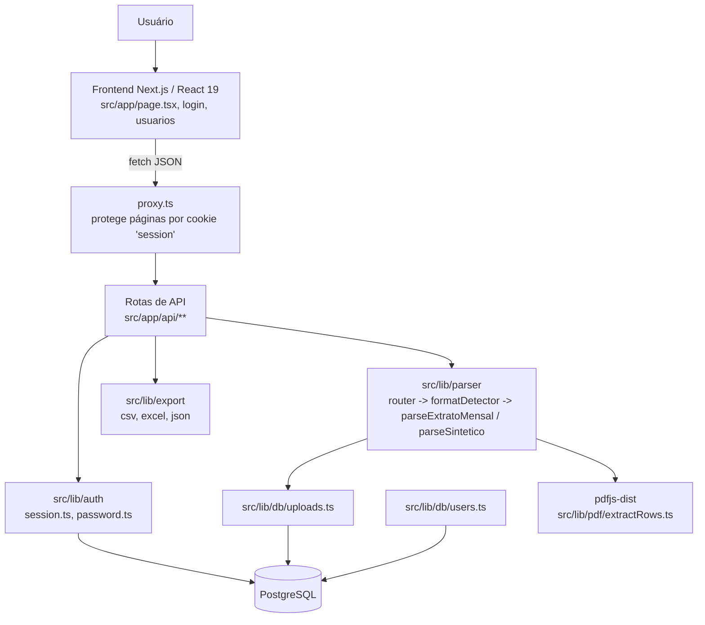
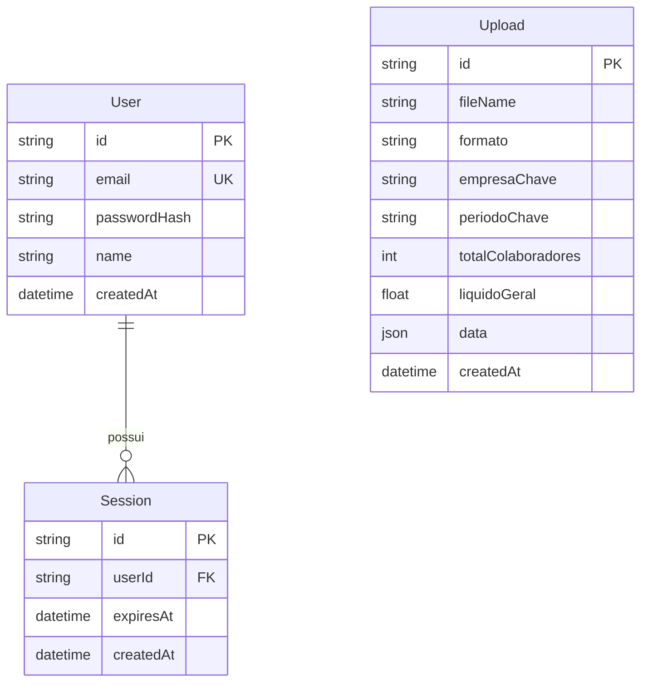

# Auditoria Completa — Extrato Mensal

> Auditoria de engenharia reversa realizada sem alterar código, banco de dados, dependências ou configuração. Nada foi corrigido nesta etapa — apenas mapeado.

---

## CONTEXTO DO PROJETO EM 5 MINUTOS

- **O que é**: aplicação web interna para **extrair dados de PDFs de folha de pagamento** (dois layouts: "Extrato Mensal" e "Relatório Sintético de Folha de Pagamento"), exibir os colaboradores extraídos em tabela filtrável e **exportar** o resultado em CSV/Excel/JSON. Tem um histórico de uploads e um cadastro simples de usuários com login.
- **Arquitetura**: Next.js 16 (App Router) full-stack — uma única aplicação Node.js. Frontend em React 19 (client components) chamando rotas de API do próprio Next (`src/app/api/**`). Sem backend separado.
- **Módulos**: (1) Autenticação/sessão, (2) Gestão de usuários, (3) Upload + parsing de PDF, (4) Visualização/filtro dos dados extraídos, (5) Exportação (CSV/Excel/JSON), (6) Histórico de uploads (com detecção de duplicado).
- **Banco**: PostgreSQL via Prisma 7. Apenas 3 tabelas: `Upload` (guarda o JSON bruto extraído), `User`, `Session`. Schema batendo 100% com as migrations — sem drift.
- **Entidades principais**: `Upload` (id, fileName, formato, empresaChave, periodoChave, data:JSON), `User` (email, passwordHash), `Session` (id = cookie, expiresAt).
- **Fluxo principal**: usuário loga → envia PDF → `POST /api/extract` extrai texto (pdfjs-dist) → detecta formato → parser específico monta o resultado → salva em `Upload.data` (JSON) → tela renderiza tabela e permite exportar.
- **Tecnologias-chave**: Next.js 16.2.10 (com a troca de `middleware.ts` → **`proxy.ts`**, uma mudança de nomenclatura da v16 já adotada corretamente no projeto), React 19, Prisma 7 + `@prisma/adapter-pg`, bcryptjs, exceljs, pdfjs-dist, Docker/Docker Compose.
- **Estado atual**: projeto pequeno, coeso, com apenas **3 commits de desenvolvimento** ("Versão 1.0", "1.1", "1.2") de um único autor, ao longo de ~2 dias. Funcional no essencial (login, upload do formato "Extrato Mensal", exportação). O formato "Relatório Sintético" está **marcado como experimental pelo próprio código** (aviso na UI: "ainda não foi validado contra um PDF real"). Sem testes automatizados formais — só scripts manuais em `scripts/`. `node_modules` não está instalado neste ambiente, então lint/typecheck/build não foram executados (ver seção 17).
- **Problemas conhecidos mais relevantes**: sem rate limiting no login, sem CSRF token explícito (mitigado parcialmente por `sameSite=lax`), sem reset de senha, sem RBAC (todo usuário logado tem acesso total, inclusive criar/remover outros usuários), sem testes automatizados, OCR não implementado (PDFs escaneados falham).
- **Próxima tarefa recomendada**: validar/testar o parser do "Relatório Sintético" com um PDF real, e decidir se vale endurecer segurança (rate limit no login, RBAC) antes de expor a mais usuários.

---

## 1. Resumo executivo

O **Extrato Mensal** é uma ferramenta interna de escritório de contabilidade/RH para poupar o trabalho manual de ler PDFs de folha de pagamento e transformá-los em planilhas. Um usuário autenticado sobe um PDF, o sistema identifica automaticamente se é um "Extrato Mensal" (detalhado, por colaborador, com rubricas) ou um "Relatório Sintético" (tabular, resumido), extrai os dados, mostra numa tela com filtros e permite exportar para Excel/CSV/JSON. Histórico dos últimos uploads fica disponível para reabrir sem reprocessar o PDF.

É usado por poucas pessoas (não há autocadastro; contas são criadas manualmente por quem já está logado). Nível de maturidade: **MVP funcional**, sem testes automatizados, com um dos dois formatos suportados ainda em fase experimental/não validada contra dado real.

## 2. Stack tecnológica

| Tecnologia | Uso no projeto | Arquivo onde foi identificada | Observação |
|---|---|---|---|
| TypeScript | Linguagem principal | `tsconfig.json`, todo `src/` | — |
| Next.js 16.2.10 | Framework full-stack (App Router) | `package.json`, `next.config.ts` | **Breaking change da v16**: `middleware.ts` foi renomeado para `proxy.ts` — o projeto já usa o nome novo (`src/proxy.ts`). Ver AGENTS.md. |
| React 19.2.4 / react-dom 19.2.4 | UI | `package.json` | Só client components (`"use client"`), sem uso visível de Server Components/Actions. |
| Node.js 20 (alpine) | Runtime | `Dockerfile` | — |
| npm | Package manager | `package-lock.json` | — |
| Prisma 7.8 + `@prisma/adapter-pg` | ORM | `prisma/schema.prisma`, `src/lib/db/prisma.ts` | Cliente gerado em `src/generated/prisma` (ignorado no git). Usa driver adapter `pg` em vez do engine binário padrão. |
| PostgreSQL 16 (alpine) | Banco de dados | `docker-compose.yml` | Container só acessível em `127.0.0.1`. |
| bcryptjs | Hash de senha | `src/lib/auth/password.ts` | 12 salt rounds. |
| Cookie de sessão (custom) | Autenticação/sessão | `src/lib/auth/session.ts`, `src/proxy.ts` | Sessão verificada no banco a cada requisição (não é JWT). |
| Tailwind CSS 4 | UI/estilo | `postcss.config.mjs`, `globals.css` | — |
| exceljs | Geração de Excel | `src/lib/export/excel.ts`, `sinteticoExport.ts` | — |
| pdfjs-dist | Leitura/parsing de PDF | `src/lib/pdf/extractRows.ts` | `serverExternalPackages` no `next.config.ts` (não bundlar). |
| pdf-lib | Geração de PDF de teste | `scripts/generate-test-sintetico-pdf.ts` (devDependency) | Só usado em script de teste manual, não em produção. |
| react-hook-form | Formulários | dependência declarada | **Não encontrado uso real em `src/`** — candidato a dependência não utilizada (ver seção 27). |
| @tanstack/react-table | Tabelas | dependência declarada | **Não encontrado uso real em `src/`** — as tabelas (`EmployeeTable`, `SinteticoTable`) parecem HTML puro. Candidato a não utilizada. |
| ESLint 9 + eslint-config-next | Lint | `eslint.config.mjs` | Não executado nesta auditoria (sem `node_modules`). |
| Docker / Docker Compose | Containerização | `Dockerfile`, `docker-compose.yml` | Dois serviços: `db` (Postgres) e `extrato-mensal-web` (Next.js). |
| E-mail, filas, cache, jobs/cron, storage externo (S3 etc.), APIs de terceiros | — | — | **Não identificado** — nenhuma integração externa encontrada no código. |
| Observabilidade/logs | `console.error` pontual | várias rotas de API | Sem logger estruturado, sem APM/Sentry. |

## 3. Arquitetura

```text
Usuário (navegador)
  ↓
Frontend (React 19, client components em src/app/**/page.tsx + src/components/**)
  ↓ fetch()
proxy.ts (equivalente ao middleware — protege páginas por cookie de sessão)
  ↓
Rotas de API (src/app/api/**/route.ts) — runtime "nodejs"
  ↓
Camada de serviço/domínio (src/lib/parser/**, src/lib/export/**, src/lib/auth/**)
  ↓
Camada de dados (src/lib/db/*.ts) usando Prisma Client
  ↓
PostgreSQL (Upload, User, Session)

(sem integrações externas / sem filas / sem cache / sem jobs assíncronos)
```



Não há camada de "serviços" separada formalmente nem repository pattern explícito — `src/lib/db/*.ts` funciona como a camada de acesso a dados (funções finas em cima do Prisma Client), e `src/lib/parser/*` é a lógica de domínio (parsing/regras de negócio do PDF).

## 4. Estrutura de diretórios

| Pasta | Finalidade | Principais arquivos | Observação |
|---|---|---|---|
| `src/app` | Rotas (App Router): páginas + API | `page.tsx`, `login/page.tsx`, `usuarios/page.tsx`, `api/**/route.ts` | Só 3 páginas de UI. |
| `src/app/api` | Backend HTTP | `auth/*`, `users/*`, `uploads/*`, `extract/route.ts` | Todas com `export const runtime = "nodejs"` (necessário por causa do Prisma/pdfjs). |
| `src/components` | Componentes React de UI | `EmployeeTable`, `SinteticoTable`, `FileUpload`, `ExportButtons`, `DuplicateUploadModal`, etc. | Sem subpastas — tudo no mesmo nível, mas o volume é pequeno o suficiente para isso não ser um problema ainda. |
| `src/lib/auth` | Autenticação | `session.ts`, `password.ts` | Sessão em banco + bcrypt. |
| `src/lib/db` | Acesso a dados | `prisma.ts`, `users.ts`, `uploads.ts` | Camada fina sobre Prisma. |
| `src/lib/parser` | Extração/parsing dos PDFs (núcleo do domínio) | `router.ts`, `formatDetector.ts`, `parsePayrollPdf.ts`, `segmentEmployees.ts`, `employeeParser.ts`, `rubricaParser.ts`, `sintetico/**` | Maior concentração de regras de negócio do sistema. |
| `src/lib/export` | Geração de CSV/Excel/JSON | `excel.ts`, `csv.ts`, `json.ts`, `rows.ts`, `sinteticoExport.ts`, `unifiedRow.ts` | — |
| `src/lib/normalize` | Normalização de valores | `money.ts` | Parsing de valores monetários em formato BR. |
| `src/lib/pdf` | Extração bruta do PDF | `extractRows.ts` | Usa `pdfjs-dist`. |
| `src/lib/types` | Tipos de domínio | `payroll.ts`, `sintetico.ts` | — |
| `prisma` | Schema + migrations | `schema.prisma`, `migrations/**` | 3 migrations, sem drift em relação ao schema. |
| `scripts` | Utilitários de linha de comando (não são testes automatizados formais) | `seed-admin.ts`, `test-*.ts` | Rodados manualmente via `npx tsx`; não fazem parte de um pipeline de CI. |
| `public` | Assets estáticos padrão do `create-next-app` | `*.svg`, `favicon.ico` | Não customizado — ainda são os arquivos padrão do template. |

## 5. Funcionalidades existentes

| Módulo | Funcionalidade | Status | Frontend | Backend | Banco | Observação |
|---|---|---|---|---|---|---|
| Autenticação | Login | COMPLETO | Sim | Sim | Sim | `/api/auth/login` |
| Autenticação | Logout | COMPLETO | Sim | Sim | Sim | `/api/auth/logout` |
| Autenticação | Sessão persistente/proteção de rotas | COMPLETO | Sim | Sim | Sim | `proxy.ts` + `requireUser()` |
| Autenticação | Recuperação/reset de senha | **NÃO EXISTE** | Não | Não | Não | Nenhum endpoint ou tela encontrados. |
| Autenticação | Autocadastro público | **NÃO EXISTE** (por design) | — | — | — | Só quem já está logado cria usuário. |
| Usuários | Criar usuário | COMPLETO | Sim | Sim | Sim | Sem validação de força de senha além do tamanho mínimo (8). |
| Usuários | Listar usuários | COMPLETO | Sim | Sim | Sim | — |
| Usuários | Remover usuário | COMPLETO | Sim | Sim | Sim | Bloqueia auto-remoção; não bloqueia remover o "último admin" (não há conceito de admin). |
| Usuários | Editar usuário/trocar senha | **INCOMPLETO** | Não | Não | — | Não existe endpoint `PATCH/PUT`. |
| Upload/Extração | Upload de PDF "Extrato Mensal" | COMPLETO | Sim | Sim | Sim | Fluxo principal e mais maduro. |
| Upload/Extração | Upload de PDF "Relatório Sintético" | **PARCIAL / EXPERIMENTAL** | Sim | Sim | Sim | O próprio código exibe aviso: "formato experimental... ainda não foi validado contra um PDF real deste layout." |
| Upload/Extração | Detecção de PDF escaneado (sem texto)/OCR | **INCOMPLETO** | Sim (mensagem de erro) | Sim | - | Mensagem explícita: "OCR ainda não está disponível nesta versão do sistema." |
| Upload/Extração | Detecção de upload duplicado | COMPLETO | Sim | Sim | Sim | Compara `formato + empresaChave + periodoChave`; oferece substituir ou manter ambos. |
| Upload/Extração | Combinar múltiplos uploads do mesmo período (multi-empresa) | COMPLETO | Sim | Sim | Sim | `combineExtratoMensalSources` — só para "extrato-mensal". |
| Upload/Extração | Edição manual de um colaborador extraído | COMPLETO (frontend, em memória) | Sim | Não persiste | Não | `EditColaboradorForm`/`handleSaveColaborador` só altera state local — não há `PATCH` que grave a edição no banco. Reload perde a edição. |
| Histórico | Listar uploads recentes | COMPLETO | Sim | Sim | Sim | Limite de 20 (`listUploads`). |
| Histórico | Reabrir upload salvo | COMPLETO | Sim | Sim | Sim | — |
| Histórico | Excluir upload do histórico | **INCOMPLETO** | Não (sem botão) | Sim (`deleteUpload` existe, usado só internamente na troca de duplicado) | Sim | Função existe em `db/uploads.ts` mas não há rota/UI para o usuário excluir um upload manualmente. |
| Exportação | Exportar CSV | COMPLETO | Sim | Sim (client-side) | - | Geração acontece no browser, não no servidor. |
| Exportação | Exportar Excel | COMPLETO | Sim | Sim (client-side) | - | `exceljs`, roda no browser. |
| Exportação | Exportar JSON | COMPLETO | Sim | Sim (client-side) | - | — |
| Exportação | Exportar PDF | **NÃO EXISTE** | Não | Não | - | `pdf-lib` só é usado em script de teste, não em exportação real. |

## 6. Perfis de usuários

Não existe RBAC nem coluna de "papel/role" no banco. Todo usuário autenticado tem exatamente os mesmos direitos.

| Perfil | Permissões | Rotas permitidas | Restrições |
|---|---|---|---|
| Usuário autenticado (único perfil existente) | Upload/extração de PDF, visualizar/exportar dados, ver histórico, criar/listar/remover outros usuários | Todas exceto `/login` quando já logado | Não pode remover a própria conta |
| Visitante (sem sessão) | Nenhuma | Só `/login` | Redirecionado para `/login` por `proxy.ts` |

**Achado de segurança**: qualquer usuário criado pode criar e apagar contas de outros usuários — não há um perfil "administrador" isolado. Ver seção 18 (Segurança).

## 7. Rotas

| Rota | Tela/Endpoint | Objetivo | Perfil permitido | APIs utilizadas | Situação |
|---|---|---|---|---|---|
| `/login` | Página de login | Autenticar | Público | `POST /api/auth/login` | Completo |
| `/` | Página principal | Upload, visualização, filtro, export | Autenticado | `/api/extract`, `/api/uploads`, `/api/uploads/[id]`, `/api/auth/me`, `/api/auth/logout` | Completo (Extrato Mensal); experimental (Sintético) |
| `/usuarios` | Gestão de usuários | Criar/listar/remover usuários | Autenticado (sem distinção de papel) | `/api/users`, `/api/users/[id]`, `/api/auth/me` | Completo |
| `POST /api/auth/login` | API | Login | Público | — | Completo |
| `POST /api/auth/logout` | API | Logout | Autenticado (mas não valida) | — | Completo |
| `GET /api/auth/me` | API | Dados do usuário logado | Autenticado | — | Completo |
| `GET /api/users` | API | Listar usuários | Autenticado | — | Completo |
| `POST /api/users` | API | Criar usuário | Autenticado | — | Completo |
| `DELETE /api/users/[id]` | API | Remover usuário | Autenticado | — | Completo |
| `POST /api/extract` | API | Upload + extração de PDF | Autenticado | — | Completo (Extrato Mensal); experimental (Sintético) |
| `GET /api/uploads` | API | Listar histórico | Autenticado | — | Completo |
| `GET /api/uploads/[id]` | API | Buscar/combinar upload salvo | Autenticado | — | Completo |

Não há páginas ou rotas órfãs aparentes — o conjunto é pequeno e todas as rotas de API são consumidas pelas 3 páginas existentes. `layout.tsx` é o layout raiz padrão.

## 8. Autenticação e autorização

- **Login**: `POST /api/auth/login` com email/senha → busca usuário por email (normalizado para minúsculo) → `bcrypt.compare` → cria `Session` no banco → seta cookie `session` (httpOnly, `sameSite=lax`, `secure` configurável via `SECURE_COOKIES`).
- **Armazenamento de usuários**: tabela `User` no Postgres.
- **Senha**: hash bcrypt, 12 salt rounds (`src/lib/auth/password.ts`) — nunca texto puro. ✅
- **Sessão**: não é JWT autocontido — é um ID de sessão opaco (`cuid`) verificado no banco a cada requisição (`Session.expiresAt`), o que permite revogar acesso a qualquer momento (ex.: deletar a sessão). Duração: 7 dias (`SESSION_DURATION_MS`).
- **Cookie**: `httpOnly`, `sameSite=lax`, `secure` = `true` em produção por padrão, mas pode ser desligado via `SECURE_COOKIES=false` (documentado no `docker-compose.yml` para deploys sem HTTPS na frente).
- **Middleware (`proxy.ts`)**: protege todas as páginas exceto `/login`, redirecionando para `/login` se não autenticado, e redirecionando de `/login` para `/` se já autenticado. **Não protege rotas de API** — cada rota de API se protege individualmente chamando `requireUser()`.
- **Logout**: apaga a sessão do banco (`destroySession`) e limpa o cookie.
- **Criação de usuário**: só por usuário já autenticado, via tela `/usuarios`.
- **Recuperação de senha**: **não existe**.
- **Perfis/RBAC**: **não existe** — ver seção 6.

### Vulnerabilidades/observações de segurança em autenticação

- 🟠 **Sem rate limiting no login** (`/api/auth/login`) — permite força bruta de senha sem qualquer limitação.
- 🟡 **Logout via `POST` sem verificação de sessão válida** — não é uma falha grave (idempotente), apenas nota.
- 🟡 **`DELETE /api/users/[id]` e `POST /api/users` não exigem nenhum papel elevado** — qualquer conta logada pode criar/apagar outras contas, inclusive potencialmente esvaziar o sistema de usuários (exceto a própria). Não há um "último admin protegido".
- 🔵 Sem CSRF token explícito. O uso de `sameSite=lax` mitiga a maioria dos ataques CSRF clássicos (GET cross-site não envia o cookie em ações state-changing feitas via `fetch` POST cross-origin em navegadores modernos), mas não é uma proteção CSRF formal — ainda é uma prática recomendada ter defesa em profundidade caso o app cresça (ex. formulários HTML cross-site em alguns cenários com `lax`).
- Não há IDOR aparente em `/api/uploads/[id]` — a busca é por `id` (cuid difícil de adivinhar) e não filtra por dono, mas como não existe "dono" do upload (recurso é compartilhado por todos os usuários por design), isso não configura uma falha em si — é uma decisão de modelo de dados (uploads são globais, não por usuário).

## 9. Banco de dados

### Inventário

| Tabela/Model | Objetivo | PK | Relacionamentos | Usada por |
|---|---|---|---|---|
| `Upload` | Guarda cada extração de PDF processada (resultado completo em JSON) | `id` (cuid) | Nenhum FK — independente | `src/lib/db/uploads.ts` |
| `User` | Contas de acesso | `id` (cuid) | 1:N com `Session` | `src/lib/db/users.ts` |
| `Session` | Sessão de login ativa | `id` (cuid, é o valor do cookie) | N:1 com `User` (`onDelete: Cascade`) | `src/lib/auth/session.ts` |

Schema, migrations e uso no código estão **consistentes** — não há SQL manual fora do Prisma, nem tabelas/colunas órfãs identificadas.

### Diagrama ER



- `Upload` não tem FK para `User`: uploads não têm "dono", são compartilhados entre todos os usuários — decisão de design implícita (não documentada, mas consistente em todo o código).
- Índice composto `[formato, empresaChave, periodoChave]` em `Upload` existe especificamente para suportar a detecção de duplicado (`findDuplicateUpload`) e a combinação multi-empresa (`getCombinedUploadById`).
- `data: Json` guarda a estrutura completa do resultado do parser (colaboradores, totais, avisos) — decisão deliberada e documentada em comentário no schema, para não ter que normalizar dois formatos de PDF muito diferentes em tabelas relacionais.

## 10. Fluxos de negócio

### Fluxo principal: Upload e extração de PDF

```text
Usuário seleciona PDF na tela "/"
→ frontend valida tipo/tamanho no client (uploadWithProgress.ts) e envia via multipart/form-data
→ POST /api/extract exige sessão válida (requireUser)
→ valida tipo (application/pdf ou extensão .pdf), tamanho (máx. 30MB)
→ parsePayrollPdfAny(buffer):
    → extractPdfRows (pdfjs-dist) extrai texto por página
    → se não há texto extraível → retorna formato "desconhecido" com aviso de que precisa de OCR (não implementado)
    → detectFormat(pages) decide entre "extrato-mensal" | "relatorio-sintetico" | desconhecido
    → parser específico monta o resultado (colaboradores/linhas + totais + avisos)
→ se formato reconhecido, verifica duplicado (mesma empresa + período já no histórico)
    → se duplicado e o front não confirmou explicitamente "replace"/"keep_both" → retorna 409 com o registro existente (a UI pergunta ao usuário)
    → se "replace" → apaga o upload anterior
→ salva o resultado em Upload.data (saveUpload)
→ retorna o resultado combinado (getCombinedUploadById, que junta múltiplos arquivos do mesmo período se for "extrato-mensal" multi-empresa)
→ frontend renderiza tabela, guarda o id em localStorage para restaurar ao recarregar a página
```

### Fluxo: Login

```text
Usuário envia email/senha em /login
→ POST /api/auth/login valida presença dos campos
→ busca User por email normalizado
→ bcrypt.compare da senha
→ se inválido → 401 genérico ("Email ou senha inválidos") — não revela qual campo está errado (boa prática)
→ se válido → cria Session no banco (7 dias) e cookie httpOnly
→ frontend redireciona para "/"
```

### Fluxo: Gestão de usuários

```text
Usuário logado acessa /usuarios
→ GET /api/users lista todos
→ criar: POST /api/users valida email/senha (mín. 8 chars) → bcrypt hash → Prisma cria; trata erro de email duplicado (P2002) com mensagem amigável
→ remover: DELETE /api/users/[id] → bloqueia se id === próprio usuário → deleta (silencioso se já não existir)
```

## 11. Máquinas de estado

Não há campo `status` explícito em nenhuma entidade do banco (`Upload`, `User`, `Session` não têm enum de estado). O único "estado" identificável é implícito na UI (`Stage` do `page.tsx`: `idle | uploading | processing | error`), que é puramente de interface, não persistido.

> NÃO FOI POSSÍVEL DETERMINAR — não há máquina de estados de negócio persistida (ex.: aprovação, pagamento) neste sistema; o domínio é "processar e exportar", não um fluxo de aprovação com estados.

## 12. Regras de negócio

| Regra | Local do código | Entidades envolvidas | Risco |
|---|---|---|---|
| Senha mínima de 8 caracteres na criação de usuário | `src/app/api/users/route.ts` | `User` | Baixo — validado só no backend (bom), mas sem outras regras de complexidade. |
| Usuário não pode remover a si mesmo | `src/app/api/users/[id]/route.ts` | `User` | Baixo |
| Upload é considerado duplicado quando `formato + empresaChave + periodoChave` coincidem | `src/lib/db/uploads.ts` (`findDuplicateUpload`, `duplicateKeysOf`) | `Upload` | Médio — se o PDF não trouxer CNPJ/competência legíveis, a checagem é pulada silenciosamente (comentário no código reconhece isso como decisão para evitar falso positivo). |
| PDF sem texto extraível (escaneado) é tratado como "desconhecido" e não processado (sem OCR) | `src/lib/parser/router.ts` | — | Médio — funcionalidade anunciada como limitação conhecida. |
| Uploads "extrato-mensal" do mesmo `periodoChave` são combinados automaticamente ao reabrir (multi-empresa) | `src/lib/db/uploads.ts` (`getCombinedUploadById`) + `combineExtratoMensal.ts` | `Upload` | Médio — lógica não trivial; validar com cuidado ao alterar. |
| Cálculo de totais gerais (líquido, quantidade de colaboradores) | `src/lib/parser/computeTotals.ts`, `sintetico/computeTotals.ts` | — | Alto (financeiro) — ver seção 15. |
| Edição de colaborador no frontend **não é persistida** no banco | `src/app/page.tsx` (`handleSaveColaborador`) | `Upload.data` | Médio — pode confundir o usuário achando que salvou. |

## 13. Integrações

> NÃO FOI POSSÍVEL IDENTIFICAR nenhuma integração externa (e-mail, Google/Microsoft, AWS/S3, Stripe, webhooks, ERPs). O sistema é autocontido: Next.js + Postgres, sem chamadas de rede para serviços de terceiros no código-fonte.

## 14. E-mails

> Não existe envio de e-mail no projeto (nenhuma biblioteca de e-mail nas dependências, nenhum código relacionado encontrado).

## 15. Uploads/documentos

- **Upload**: só arquivos PDF (validação por content-type OU extensão `.pdf`), limite de 30MB (`src/app/api/extract/route.ts`), processado inteiramente em memória (`arrayBuffer()` → `Buffer`), **não é salvo em disco/storage** — só o resultado extraído (JSON) é persistido no banco. O arquivo original não é retido.
- **Exportação** (download): CSV/Excel/JSON são gerados **no navegador** (`src/lib/export/*`), não no servidor — reduz carga no servidor, mas significa que a lógica de formatação de exportação roda só client-side.
- **Segurança de upload**: validação de tipo é superficial (checa `file.type`/extensão, não o conteúdo/magic bytes do arquivo) — um arquivo não-PDF renomeado para `.pdf` passaria a validação inicial e só falharia (ou não) na etapa de extração via `pdfjs-dist`. Risco baixo dado que o resultado só é interpretado como texto/JSON, sem execução.
- Não há PDFs/imagens armazenados com URLs públicas/privadas — não há exposição de arquivo bruto.

## 16. Docker

### `Dockerfile` (multi-stage)
1. `deps`: `npm ci`.
2. `builder`: copia tudo, roda `prisma generate` (com `DATABASE_URL` fictícia — só lê o schema) e `npm run build`.
3. `runner`: copia `node_modules` completo (não usa a saída "standalone" do Next — decisão documentada no próprio Dockerfile: `prisma migrate deploy` no entrypoint precisa do CLI do Prisma, e recortar manualmente a saída standalone já causou problemas com o worker do `pdfjs-dist`), roda como usuário não-root `nextjs`.

### `docker-compose.yml`
- Serviço `db`: Postgres 16 alpine, exposto só em `127.0.0.1:${DB_PORT:-5433}` (não exposto na rede) — boa prática de segurança documentada em comentário.
- Serviço `extrato-mensal-web`: builda a partir do `Dockerfile`, depende de `db` com `healthcheck`, recebe `DATABASE_URL` montada a partir das variáveis do Postgres e `SECURE_COOKIES`.
- `docker-entrypoint.sh`: roda `prisma migrate deploy` antes de `npm run start` — aplica migrations automaticamente no boot do container (atenção: em produção, uma migration destrutiva rodaria automaticamente sem confirmação manual).

## 17. Ambiente de desenvolvimento

**Não existe `.env.example`** no repositório — variável obrigatória não está documentada para quem clona o projeto (ver seção 18/débitos).

Sequência de subida local (Docker, reconstruída a partir do compose/entrypoint — **apenas documentado, não executado**):

```bash
git clone <repo>
cd projeto-fran
# criar .env manualmente na raiz com pelo menos:
#   POSTGRES_PASSWORD=<algo>
# opcionalmente: POSTGRES_USER, POSTGRES_DB, DB_PORT, WEB_PORT, SECURE_COOKIES
docker compose up -d --build
# migrations rodam automaticamente no boot do container web (docker-entrypoint.sh)
docker compose exec extrato-mensal-web npx tsx scripts/seed-admin.ts admin@exemplo.com "senha-forte" "Admin"
# abrir http://localhost:${WEB_PORT:-3000}
```

Pré-requisitos na máquina: Docker + Docker Compose. Para desenvolvimento sem Docker: Node.js 20+, um Postgres acessível via `DATABASE_URL`, `npm install`, `npx prisma migrate deploy` (ou `dev`), `npm run dev`.

### Build/lint/typecheck/testes — NÃO EXECUTADO

`node_modules` não está instalado neste ambiente de auditoria, e a instrução do escopo pede para não realizar ações que alterem o projeto além do necessário para análise passiva; instalar dependências (`npm ci`) seria uma operação de rede/escrita fora do que foi pedido nesta fase. Comandos que deveriam ser rodados para validar o estado do projeto:

```bash
npm ci
npm run lint
npx tsc --noEmit
npm run build
```

Status: **NÃO EXECUTADO** para todos os quatro. Recomenda-se rodá-los como primeiro passo da Fase 1 do plano de retomada (seção "Plano de Retomada").

## 18. Produção/deploy

> NÃO FOI POSSÍVEL DETERMINAR COM SEGURANÇA onde o projeto roda em produção hoje (sem GitHub Actions, sem configuração de Vercel/Railway/Render/AWS encontrada no repositório).

O que está comprovado pelo código é o **caminho de deploy via Docker**:

```text
Build local/CI (não identificado) → docker build (Dockerfile) → docker compose up → container roda `prisma migrate deploy` → `npm run start` → Postgres (container próprio, não gerenciado)
```

Não há Nginx, CI/CD (GitHub Actions ausente — nenhuma pasta `.github/workflows`), nem scripts de deploy automatizado além do próprio `docker-entrypoint.sh`. Presume-se deploy manual em uma VPS rodando `docker compose up -d --build`, mas isso é **inferência**, não fato comprovado.

## 19. Testes

| Tipo | Ferramenta | Quantidade aproximada | Cobertura funcional |
|---|---|---|---|
| Unitários | Nenhum framework de teste (sem Jest/Vitest nas dependências) | 0 | Nenhuma |
| Scripts manuais de verificação | `tsx` (execução direta, sem asserts automatizados/CI) | 6 scripts (`scripts/test-*.ts`) | Cobrem parsing (`test-parse.ts`, `test-router.ts`, `test-sintetico*.ts`) e exportação (`test-excel-output.ts`, `test-unified-excel.ts`) manualmente, exigindo inspeção visual do output |
| Integração | Nenhum | 0 | Nenhuma |
| E2E | Nenhum | 0 | Nenhuma |

Status de execução: **NÃO EXECUTADO** nesta auditoria (dependem de `node_modules` e, em alguns casos, de um PDF de amostra/banco disponível).

## 20. Segurança

| Item | Classificação | Observação |
|---|---|---|
| Senha em texto puro | ✅ Não ocorre | bcrypt 12 rounds |
| SQL Injection | ✅ Não identificado | Uso exclusivo do Prisma Client (queries parametrizadas), sem SQL raw |
| Autorização só no frontend | ✅ Não ocorre | Todas as rotas de API chamam `requireUser()` no servidor |
| IDOR | 🔵 Baixo | `Upload` não tem dono — é por design (recurso compartilhado), não uma falha de controle de acesso quebrado |
| Rate limiting no login | 🟠 Alto | Inexistente — força bruta de senha não é mitigada |
| RBAC / privilégio de administrador | 🟠 Alto | Qualquer conta pode criar/apagar outras contas; não há papel "admin" isolado |
| CSRF | 🟡 Médio | Sem token CSRF explícito; mitigado parcialmente por `sameSite=lax` |
| Validação de tipo de upload | 🟡 Médio | Baseada em `content-type`/extensão, não em conteúdo real do arquivo |
| Exposição de stack trace | 🔵 Baixo | Erros retornam `error.message` ao cliente em alguns pontos (`/api/extract`) — pode vazar detalhes internos de parsing, mas não stack completo |
| `.env.example` ausente | 🟡 Médio | Dificulta configuração segura por quem sobe o ambiente pela primeira vez |
| Cookie `secure` desligável | 🔵 Baixo (decisão documentada) | `SECURE_COOKIES=false` é necessário só em deploy HTTP puro sem proxy TLS — risco quando usado, mas está claramente documentado no compose |
| Migrations aplicadas automaticamente no boot (`prisma migrate deploy`) | 🟡 Médio | Sem etapa de aprovação manual antes de aplicar em produção |
| XSS | ✅ Não identificado | React escapa por padrão; não há uso de `dangerouslySetInnerHTML` encontrado |
| Path traversal / Open redirect | ✅ Não identificado | Sem manipulação de paths de arquivo a partir de input do usuário; sem redirects para URLs externas controladas por input |

## 21. Performance

- `listUploads` já usa `take: 20` (paginação básica) e `select` restrito — ok.
- `getCombinedUploadById` para "extrato-mensal" busca **todos** os uploads do mesmo `periodoChave` sem limite — aceitável dado o volume esperado (poucas empresas por período), mas sem paginação caso cresça muito.
- Exportação (CSV/Excel) roda **no navegador**, não no servidor — evita carga de CPU no backend para essa etapa, mas pode ser lenta/pesada no cliente para volumes grandes de colaboradores.
- Parsing de PDF (`pdfjs-dist`) é síncrono/bloqueante dentro da rota (`runtime: "nodejs"`) — para PDFs grandes (até 30MB permitido) pode segurar a requisição por bastante tempo; não há fila/job assíncrono.
- Não há índices faltando aparentes: o único índice necessário (`Upload_formato_empresaChave_periodoChave_idx`) existe.
- Nenhum N+1 óbvio identificado — poucas queries, sem loops fazendo query por item.

## 22. Débitos técnicos

- Falta `.env.example` documentando `DATABASE_URL`, `SECURE_COOKIES`, `POSTGRES_*`, `DB_PORT`, `WEB_PORT`.
- `react-hook-form` e `@tanstack/react-table` declarados em `package.json` mas sem uso aparente em `src/` — candidatos a dependência morta (confirmar com `grep` mais fino / lint de imports não usados antes de remover).
- Sem testes automatizados (só scripts manuais).
- Sem CI/CD.
- Edição de colaborador no modal não persiste (`handleSaveColaborador` só atualiza state local) — comportamento pode confundir usuários achando que a alteração foi salva.
- Não há endpoint para excluir um upload do histórico via UI (função de banco existe, mas não exposta).
- Sem RBAC — API de usuários totalmente aberta a qualquer conta autenticada.

## 23. Funcionalidades incompletas

| Funcionalidade | Evidência | Situação | Próximo passo provável |
|---|---|---|---|
| OCR para PDF escaneado | Mensagem hardcoded: "OCR ainda não está disponível nesta versão do sistema" (`router.ts`) | Incompleto (funcionalidade anunciada, não implementada) | Integrar OCR (ex.: Tesseract) para o caminho `hasExtractableText === false` |
| Relatório Sintético | Aviso na UI: "Formato experimental... ainda não foi validado contra um PDF real deste layout" (`page.tsx`) | Parcial/não validado | Validar parser contra PDFs reais desse layout |
| Edição de colaborador persistente | `handleSaveColaborador` só altera `useState`, sem chamada de API | Interface sem persistência | Criar `PATCH /api/uploads/[id]` (ou similar) para gravar a edição de volta no `Upload.data` |
| Exclusão de upload pela UI | `deleteUpload()` existe em `db/uploads.ts`, mas só é chamado internamente ao substituir duplicado | Backend sem frontend | Expor endpoint `DELETE /api/uploads/[id]` + botão na UI |
| Papéis/administração | Nenhuma coluna `role` em `User`, toda conta tem os mesmos poderes | Não iniciado | Adicionar `role` em `User` e checagem em `/api/users/*` |
| Reset de senha | Nenhum endpoint, tela ou coluna de token de reset | Não iniciado | Definir fluxo (e-mail não está configurado no projeto — precisaria dessa integração primeiro) |

## 24. Problemas críticos

### 🔴 Críticos
Nenhum problema classificado como crítico (perda de dados, falha de segurança grave, quebra de produção) foi identificado.

### 🟠 Altos

```text
Problema: Ausência de rate limiting no login
Arquivo: src/app/api/auth/login/route.ts
Impacto: Permite tentativas ilimitadas de força bruta de senha
Evidência: Nenhuma lógica de limitação de tentativas/IP no handler POST
Correção sugerida: Rate limit por IP/email (ex. contador em Redis ou tabela simples com janela deslizante)
Prioridade: Alta
```

```text
Problema: Sem RBAC — qualquer usuário autenticado pode criar/apagar outras contas
Arquivo: src/app/api/users/route.ts, src/app/api/users/[id]/route.ts
Impacto: Um usuário comprometido ou mal-intencionado pode remover todas as outras contas (exceto a própria)
Evidência: requireUser() apenas checa autenticação, não papel/permissão
Correção sugerida: Introduzir campo role em User e checagem de admin nessas rotas
Prioridade: Alta
```

### 🟡 Médios

```text
Problema: Edição de colaborador no modal não é persistida no banco
Arquivo: src/app/page.tsx (handleSaveColaborador)
Impacto: Usuário pode achar que salvou uma correção e perdê-la ao recarregar
Evidência: Só chama setResult(...), sem fetch para API
Correção sugerida: Criar endpoint para persistir a edição em Upload.data, ou deixar explícito na UI que é só uma visualização temporária
Prioridade: Média
```

```text
Problema: Falta .env.example
Arquivo: raiz do projeto
Impacto: Dificulta onboarding e aumenta risco de configuração incorreta/insegura em produção
Evidência: Ausência do arquivo; variáveis usadas só descobertas lendo código/compose
Correção sugerida: Criar .env.example documentando DATABASE_URL, POSTGRES_*, SECURE_COOKIES, DB_PORT, WEB_PORT
Prioridade: Média
```

```text
Problema: Validação de upload por content-type/extensão, não por conteúdo real
Arquivo: src/app/api/extract/route.ts
Impacto: Arquivo não-PDF renomeado passa a validação inicial (baixo risco de exploração dado que só é tratado como texto)
Evidência: looksLikePdf checa file.type / nome do arquivo
Correção sugerida: Validar magic bytes (%PDF-) antes de processar
Prioridade: Média
```

### 🔵 Baixos

```text
Problema: Dependências possivelmente não utilizadas (react-hook-form, @tanstack/react-table)
Arquivo: package.json
Impacto: Peso extra no bundle/instalação, confusão sobre stack real
Evidência: Nenhum import encontrado em src/ nesta auditoria (confirmar com lint antes de remover)
Correção sugerida: Confirmar com `grep`/lint e remover se de fato não usadas
Prioridade: Baixa
```

```text
Problema: Sem endpoint para excluir upload do histórico pela UI
Arquivo: src/lib/db/uploads.ts (deleteUpload não exposto), sem rota DELETE /api/uploads/[id]
Impacto: Histórico só pode crescer ou ser trocado via fluxo de duplicado
Evidência: Função existe mas só é chamada internamente
Correção sugerida: Expor rota + botão de exclusão
Prioridade: Baixa
```

## 25. Backlog recomendado

1. Rodar `npm ci && npm run lint && npx tsc --noEmit && npm run build` e corrigir o que aparecer (Fase 1).
2. Criar `.env.example`.
3. Adicionar rate limiting no login.
4. Introduzir papel de administrador (`role` em `User`) e restringir `/api/users/*`.
5. Validar o parser do "Relatório Sintético" contra PDF real e remover o aviso de "experimental" quando confirmado.
6. Decidir sobre OCR (implementar ou remover a promessa da mensagem de erro).
7. Persistir edição de colaborador ou deixar claro na UI que é temporária.
8. Confirmar e remover dependências não usadas.
9. Expor exclusão de upload do histórico.
10. Adicionar testes automatizados mínimos para o parser (é a lógica de maior risco/complexidade do sistema).

## 26. Próximos passos

Ver "GUIA RÁPIDO PARA RETOMAR O PROJETO" e "PLANO DE RETOMADA" abaixo.

---

# GUIA RÁPIDO PARA RETOMAR O PROJETO

### O que é o sistema?
Uma ferramenta interna para transformar PDFs de folha de pagamento (dois layouts possíveis) em dados estruturados navegáveis e exportáveis (CSV/Excel/JSON), com histórico e login simples.

### Como ele funciona?
Next.js 16 App Router full-stack: páginas React chamam rotas de API do próprio Next, que usam Prisma para falar com Postgres. O núcleo é o parser de PDF em `src/lib/parser/`.

### Qual é o fluxo principal?
Login → upload de PDF em `/` → `POST /api/extract` extrai e salva → tela mostra tabela filtrável → exportar CSV/Excel/JSON.

### Quais são os módulos?
Autenticação, Usuários, Upload/Parsing de PDF, Visualização/Filtros, Exportação, Histórico de uploads.

### Onde ficam as principais regras?
`src/lib/parser/**` (extração/parsing, a parte mais complexa do sistema) e `src/lib/db/uploads.ts` (duplicidade, combinação multi-empresa).

### Onde fica o acesso ao banco?
`src/lib/db/prisma.ts` (client), `src/lib/db/users.ts`, `src/lib/db/uploads.ts`. Schema em `prisma/schema.prisma`.

### Onde ficam as APIs?
`src/app/api/**/route.ts` (auth, users, uploads, extract).

### Onde ficam as páginas?
`src/app/page.tsx` (principal), `src/app/login/page.tsx`, `src/app/usuarios/page.tsx`.

### Como funciona a autenticação?
Cookie de sessão (`session`) opaco, verificado no banco a cada requisição (tabela `Session`), 7 dias de validade. `src/proxy.ts` (é o `middleware.ts` renomeado no Next 16) protege páginas; cada rota de API valida com `requireUser()`.

### Como rodar localmente?
Ver seção 17 acima — via Docker Compose (`docker compose up -d --build`) após criar um `.env` com `POSTGRES_PASSWORD`.

### Como testar?
Não há suite automatizada. Rodar manualmente os scripts em `scripts/test-*.ts` via `npx tsx scripts/<arquivo>.ts` e inspecionar a saída.

### Como fazer build?
`npm run build` (ou dentro do `Dockerfile`, já parametrizado com `DATABASE_URL` fictícia para o `prisma generate`).

### Como realizar deploy?
Único caminho comprovado no repositório: `docker compose up -d --build` (aplica migrations automaticamente no boot via `docker-entrypoint.sh`). Onde isso roda hoje em produção: **NÃO FOI POSSÍVEL DETERMINAR**.

### Quais cuidados devo ter?
- Migrations rodam automaticamente no boot do container — cuidado ao mexer em `prisma/schema.prisma`, teste a migration antes de subir em produção.
- Não há rate limiting no login — evite expor a aplicação diretamente à internet sem colocar alguma proteção na frente (proxy reverso com rate limit, por exemplo) enquanto isso não for implementado no app.
- Qualquer usuário logado pode apagar outras contas — cuidado com quem recebe credenciais.
- `SECURE_COOKIES=false` só deve ser usado atrás de rede confiável/sem TLS temporário — nunca em produção exposta.

### O que está incompleto?
OCR, validação real do "Relatório Sintético", persistência de edição manual de colaborador, exclusão de upload pela UI, RBAC, reset de senha. Ver seção 23.

### Qual deveria ser minha próxima tarefa?
Rodar lint/typecheck/build para ver o estado real de compilação (nunca executado nesta auditoria por falta de `node_modules`), depois decidir entre validar o "Relatório Sintético" com um PDF real ou fechar os gaps de segurança (rate limit + RBAC) antes de dar acesso a mais pessoas.

---

## "SE EU PRECISAR ALTERAR X, ONDE DEVO IR?"

| Quero alterar... | Arquivos/pastas prováveis |
|---|---|
| Login/sessão | `src/lib/auth/session.ts`, `src/app/api/auth/**`, `src/proxy.ts` |
| Usuários/permissões | `src/lib/db/users.ts`, `src/app/api/users/**`, `src/app/usuarios/page.tsx` |
| Banco/schema | `prisma/schema.prisma` (+ nova migration com `prisma migrate dev`) |
| Parsing do "Extrato Mensal" | `src/lib/parser/parsePayrollPdf.ts`, `segmentEmployees.ts`, `employeeParser.ts`, `rubricaParser.ts`, `companyParser.ts` |
| Parsing do "Relatório Sintético" | `src/lib/parser/sintetico/**` |
| Detecção de formato do PDF | `src/lib/parser/formatDetector.ts`, `src/lib/parser/router.ts` |
| Duplicidade/combinação de uploads | `src/lib/db/uploads.ts`, `src/lib/parser/combineExtratoMensal.ts` |
| Exportação (Excel/CSV/JSON) | `src/lib/export/**` |
| Upload/tela principal | `src/app/page.tsx`, `src/components/FileUpload.tsx`, `src/lib/uploadWithProgress.ts` |
| PDF (leitura bruta) | `src/lib/pdf/extractRows.ts` |
| Normalização de valores monetários | `src/lib/normalize/money.ts` |
| Docker/deploy | `Dockerfile`, `docker-compose.yml`, `docker-entrypoint.sh` |
| Dashboard/relatórios | Não existe módulo de dashboard separado — a própria tela `/` já cumpre esse papel (`SummaryCards`, `SinteticoSummaryCards`) |
| PDF de saída (geração) | Não existe geração de PDF em produção hoje — só leitura. `pdf-lib` só aparece em `scripts/generate-test-sintetico-pdf.ts` (script de teste) |
| Excel (geração) | `src/lib/export/excel.ts`, `src/lib/export/sinteticoExport.ts` |

---

## PLANO DE RETOMADA

### Fase 1 — Estabilização
- Instalar dependências e rodar `lint`, `typecheck` e `build` para conhecer o estado real de compilação (nunca verificado nesta auditoria).
- Criar `.env.example`.
- Rodar os scripts manuais em `scripts/test-*.ts` para confirmar que o parser ainda funciona como esperado.

### Fase 2 — Débitos técnicos
- Adicionar rate limiting no login.
- Introduzir RBAC básico (`role` em `User`) e restringir `/api/users/*`.
- Confirmar e remover dependências não utilizadas (`react-hook-form`, `@tanstack/react-table`, se confirmado).
- Validar upload por magic bytes, não só extensão/content-type.

### Fase 3 — Funcionalidades incompletas
- Validar/corrigir o parser do "Relatório Sintético" com PDFs reais.
- Persistir a edição manual de colaborador (ou remover a impressão de que ela é salva).
- Expor exclusão de upload do histórico pela UI.
- Decidir sobre OCR (implementar ou remover a mensagem que promete a funcionalidade).

### Fase 4 — Novas evoluções
- Somente após as fases acima: reset de senha, testes automatizados formais (unitários para o parser, que é a parte de maior risco), CI/CD, observabilidade/logs estruturados.

---

## Notas finais sobre esta auditoria

- Nenhum código, dependência, migration ou dado foi alterado.
- `node_modules` não estava presente neste ambiente; lint/typecheck/build/testes **não foram executados** — apenas documentados como próximo passo.
- Onde a informação não pôde ser confirmada pelo código, banco, documentação ou Git (ex.: onde o sistema roda em produção hoje), isso foi marcado explicitamente como **NÃO FOI POSSÍVEL DETERMINAR COM SEGURANÇA**, em vez de suposto.
